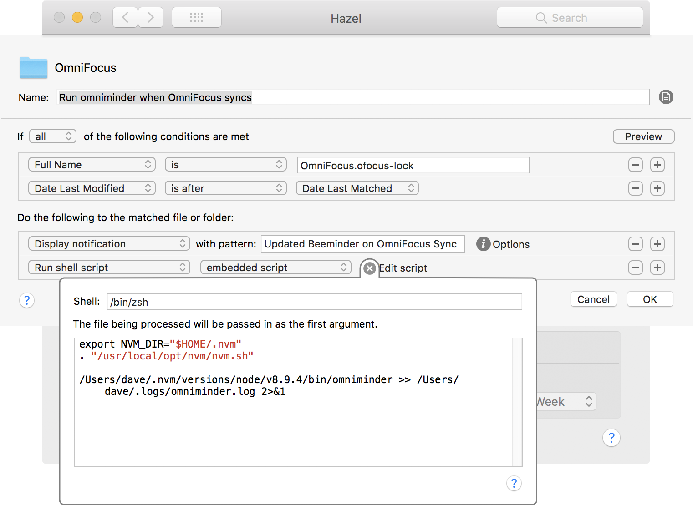

# omniminder

omniminder is a script for connecting OmniFocus to Beeminder goals. This tool depends on AppleScript, which is only available in the Pro flavors of OmniFocus. While it may work with OmniFocus Pro 2, I am only using it and testing it with OmniFocus Pro 3. The script also depends on Node.js. I suggest using Node Version Manager (nvm) to get an up-to-date version of Node.js, which can easily be installed via [Homebrew](https://brew.sh).

omniminder is intended to run whenever OmniFocus syncs. While there isn't any _official_ way to run scripts on the sync event in OmniFocus, the modified time on the app's database file (`$HOME/Library/Containers/com.omnigroup.OmniFocus3/Data/Library/Application Support/OmniFocus/OmniFocus.ofocus`) reliably changes whenever a sync occurs. I use Noodlesoft's Hazel to run the script in response to the file changing. If you don't own Hazel, you could also set up a cron job or just run the script manually.

The OmniFocus automation is itself implemented using JavaScript for Automation, but executed from within the context of Node.js scripts (so that they can interact with the Beeminder API conveniently).

Whenever the Omni Group introduces their own JavaScript automation engine into OmniFocus, I may loop that in as well. One project, three different JavaScript interpreters... fun!

This script is cobbled-together scaffolding for my own set-up! Feel free to clone and tinker, but I make no guarantee to fix any bugs relevant to your OS configuration, etc. I would _love_ to hear how your experience goes, though -- over time, I _may_ try to formalize these into a more general tool.

## Features

- Beemind the number of items in your OmniFocus Inbox.
- Beemind the number of projects that are due for review.
- Beemind arbitrary tasks completed in the last 48 hours.

## Setup

### Install the omniminder script

In the root directory of this repository, run `npm install -g`.

### Create an omniminder config file

Run these commands to initialize the omniminder config file:

```
mkdir $HOME/.omniminder
echo "{}" > $HOME/.omniminder/config.json
```

Then open `$HOME/.omniminder/config.json` in a text editor and configure your goal mappings:

```json
{
  "authToken": "INSERT_YOUR_AUTH_TOKEN_HERE",
  "inboxGoal": "omnifocus-inbox",
  "reviewGoal": "omnifocus-review",
  "completedTaskRules": [
		{
			"slug": "gratitude",
			"project": "Routines",
			"taskName": "Write in gratitude journal"
		}
	]
}
```

You can find your auth token under [your Beeminder user settings](https://www.beeminder.com/settings/account#account-permissions).

### Configure Hazel to run omniminder (optional)

In Hazel, create a rule group for the folder `$HOME/Library/Containers/com.omnigroup.OmniFocus3/Data/Library/Application Support/OmniFocus`, then configure a rule to trigger on the file `OmniFocus.ofocus` on the condition "Date Last Modified did change":



Change the paths in the embedded script as appropriate for your own computer. To find the location of the omniminder script, you can run `which omniminder` in a terminal.

### Map omniminder to your own Beeminder goals.

I haven't yet made the connection between OmniFocus stats and Beeminder goals configurable. If you want to use this script yourself, you'll need to edit `omniminder.js` to set up your own data points.